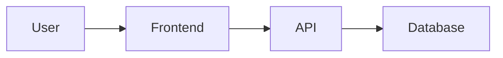

# Forever Message - Documentation

Official documentation for the Forever Message project.

## Overview

Forever Message is a decentralized application that allows users to create and share messages in digital bottles. The app combines blockchain technology (Base Sepolia), IPFS storage (Storacha), and traditional web technologies to create an immersive experience.

## Documentation Structure

### [Getting Started](./getting-started.md)
New to the project? Start here to learn how to set up your development environment, understand the repository structure, and make your first contribution.

### Architecture

#### [Overview](./architecture/overview.md)
High-level system architecture, monorepo structure, core components, deployment architecture, and async processing patterns.

**Topics covered:**
- System architecture diagram
- Monorepo package structure
- Frontend, backend, database, and blockchain components
- Deployment environment
- Async processing (queue + webhook pattern)
- Security considerations
- Performance optimizations

#### [Data Flow Diagrams](./architecture/data-flow.md)
Detailed sequence diagrams showing how data moves through the system for various operations.

**Flows covered:**
- Bottle creation (queue → webhook → IPFS → blockchain)
- Like/Unlike (optimistic UI → API → blockchain)
- Comment creation (IPFS → blockchain)
- Authentication (SIWE wallet-based auth)
- Bottle sync (cron job syncing blockchain to DB)

#### [Tech Stack](./architecture/tech-stack.md)
Complete overview of all technologies, libraries, and tools used in Forever Message.

**Sections:**
- Frontend (Next.js, React, Three.js, RainbowKit, wagmi)
- Backend (Next.js API Routes, Supabase Auth)
- Blockchain (Solidity, ethers.js, viem, Base Sepolia)
- Storage (Supabase PostgreSQL, Storacha IPFS)
- Infrastructure (Netlify, Alchemy)
- Development tools (TypeScript, ESLint, Git)
- Technology decisions and trade-offs

## Quick Links

- **Main Repository**: [forever-message-client](../forever-message-client)
- **Smart Contracts**: [forever-message-contract](../forever-message-contract)
- **Shared Types**: [forever-message-types](../forever-message-types)
- **IPFS Service**: [forever-message-ipfs](../forever-message-ipfs)

## Key Concepts

### Monorepo Structure
Forever Message is organized as a monorepo with multiple packages that work together:
- `forever-message-client`: Next.js frontend application
- `forever-message-contract`: Solidity smart contracts
- `forever-message-types`: Shared TypeScript types
- `forever-message-ipfs`: IPFS service library
- `forever-message-docs`: This documentation

### Tech Stack Summary
- **Frontend**: Next.js 14, React 18, Konva (2D canvas), Tailwind CSS, anime.js
- **Wallet**: wagmi, viem, SIWE
- **Backend**: Next.js API Routes, Supabase Auth
- **Database**: Supabase (PostgreSQL)
- **Blockchain**: Base Sepolia, ethers.js
- **Storage**: Storacha (IPFS + Filecoin)
- **Typography**: ApfelGrotezk (UI), AndreaScript (decorative)
- **Design**: Glass-morphism (ocean aesthetic) + Parchment (vintage aesthetic)
- **Testing**: Cypress (E2E), Jest + RTL (Unit/Component)
- **Code Quality**: ESLint + Prettier, CI/CD pipeline
- **Hosting**: Netlify

### Core Features
- **Onboarding Experience**: Animated loading screen explaining app functionality
- **Glass-Morphism UI**: Modern ocean-themed design with cyan/turquoise palette
- **2D Ocean Canvas**: Interactive bottle visualization with Konva
- **Wallet Authentication**: Sign-in with Ethereum (SIWE)
- **Professional Animations**: anime.js timeline orchestration for UI sequences
- **Spring Physics**: React Spring for natural, interactive motion
- **Real-time Queue Tracking**: Toast notifications for bottle creation progress
- **Decentralized Storage**: IPFS for message content
- **Blockchain Immutability**: NFTs on Base Sepolia
- **Async Processing**: Queue-based bottle creation with webhooks
- **Custom Typography**: ApfelGrotezk and AndreaScript fonts
- **Dual Design Systems**: Glass-morphism and parchment aesthetics
- **Comprehensive Testing**: E2E and unit test coverage
- **Code Quality**: Automated linting, formatting, and CI/CD

## Contributing

### Documentation Updates

1. Clone the repository
2. Navigate to `forever-message-docs`
3. Make changes to the relevant `.md` files
4. Preview with any Markdown viewer (GitHub supports Mermaid)
5. Submit a pull request

### Architecture Changes

When making significant architectural changes to the codebase:

1. Update relevant documentation first
2. Create diagrams for new flows (use Mermaid)
3. Document new technologies in `tech-stack.md`
4. Update getting started guide if needed

## Mermaid Diagrams

This documentation uses [Mermaid](https://mermaid.js.org/) for diagrams. GitHub renders Mermaid natively in Markdown.

**Example:**

## Maintenance Philosophy

This documentation is intentionally **concept-focused** rather than **step-by-step code tutorials**. This approach:

- **Reduces tech debt**: Concepts change less than implementation details
- **Stays relevant longer**: No need to update for minor code changes
- **Teaches understanding**: Helps developers grasp the "why" not just the "how"
- **Enables autonomy**: Developers can make informed decisions

## License

MIT License - see [LICENSE](./LICENSE) for details

## Support

- **Issues**: [GitHub Issues](https://github.com/loscolmebrothers/forever-message/issues)
- **Questions**: Open a discussion or issue on GitHub
- **Updates**: Watch this repo for documentation updates