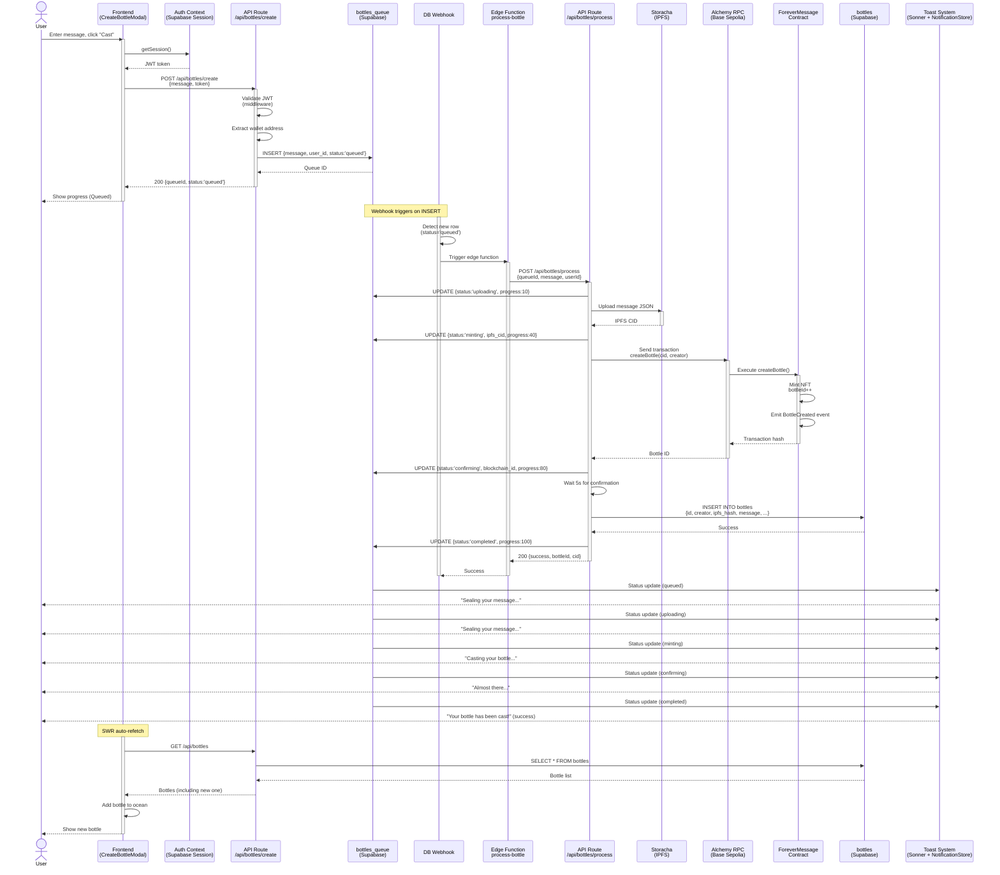
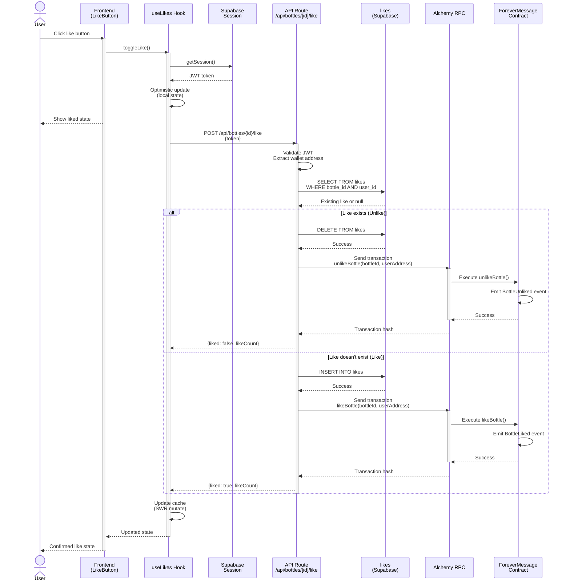
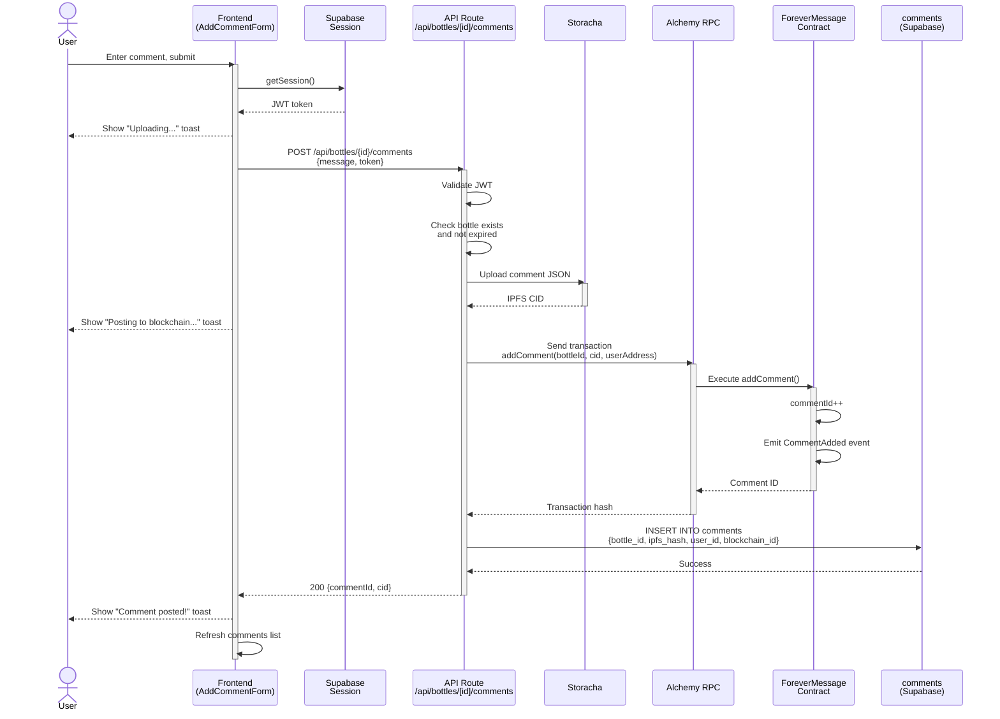
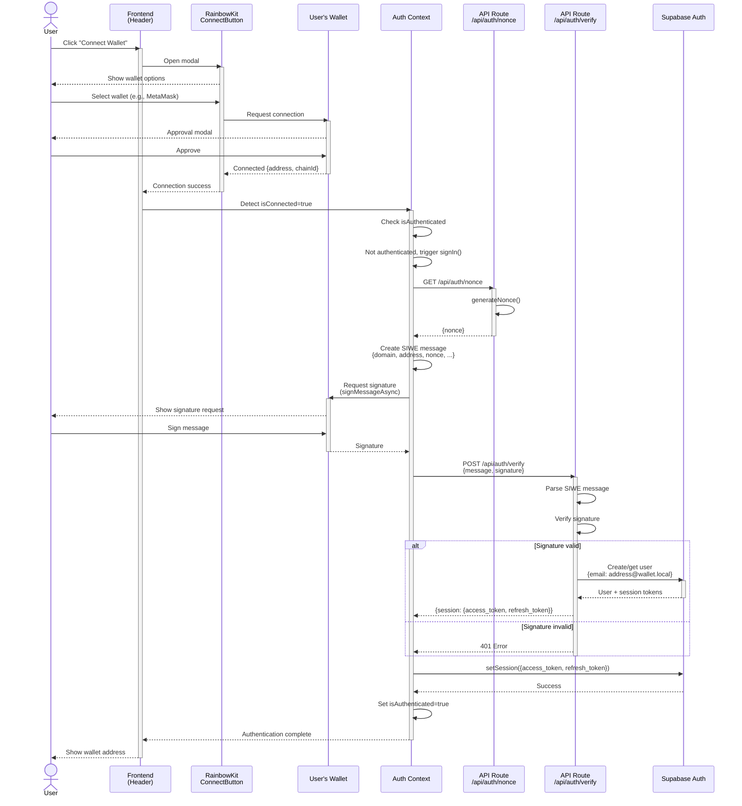
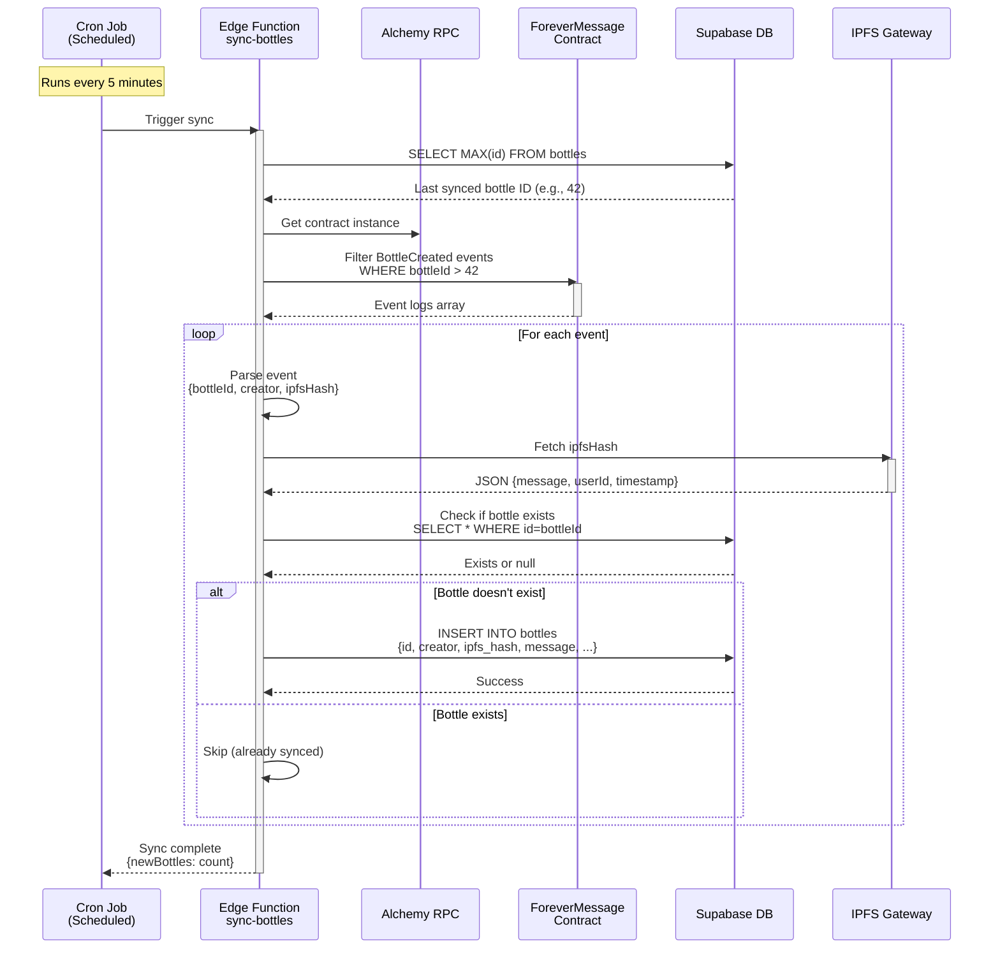
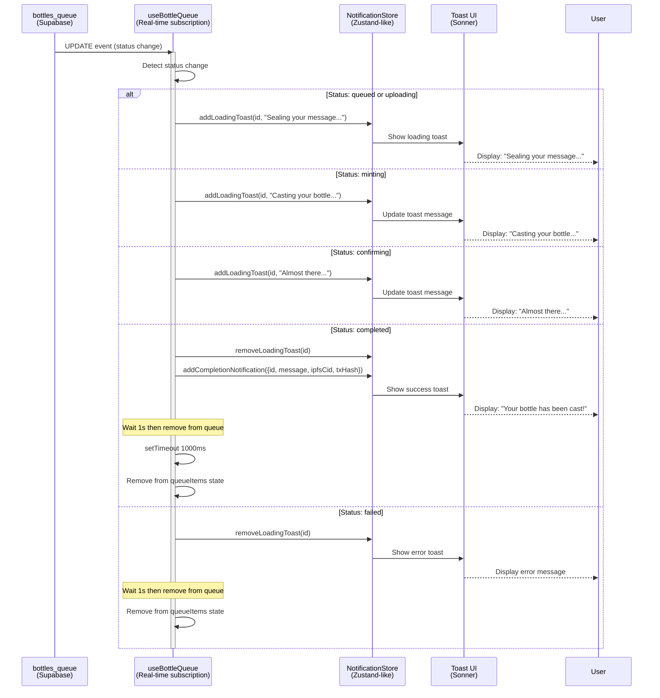

# Data Flow Diagrams

This document illustrates the key data flows in Forever Message, showing how information moves through the system for various operations.

## Table of Contents
1. [Bottle Creation Flow](#bottle-creation-flow)
2. [Like/Unlike Flow](#likeunlike-flow)
3. [Comment Creation Flow](#comment-creation-flow)
4. [Authentication Flow](#authentication-flow)
5. [Bottle Sync Flow](#bottle-sync-flow)

---

## Bottle Creation Flow

This is the most complex flow in the system, involving queuing, async processing, IPFS upload, and blockchain interaction.

### Key Points
- **Instant Response**: User gets response in <1s
- **Async Processing**: Heavy work happens in background (60s timeout)
- **Progress Tracking**: `bottles_queue` status updated throughout
- **Reliability**: If processing fails, error stored in queue for debugging

---

## Like/Unlike Flow

Simpler flow that requires authentication and updates both database and blockchain.

### Key Points
- **Optimistic Updates**: UI updates immediately for better UX
- **Dual Write**: Database + blockchain for redundancy
- **Idempotent**: Toggle behavior (like → unlike → like)
- **Auth Required**: Must be signed in to like

---

## Comment Creation Flow

Similar to bottle creation but simpler (no queuing needed).

### Key Points
- **Synchronous**: Comment posted immediately (within timeout)
- **IPFS First**: Upload to IPFS before blockchain
- **Toast Feedback**: Clear progress indicators for user
- **No Queue**: Simpler than bottles, completes in ~3-5s

---

## Authentication Flow

SIWE (Sign-In With Ethereum) flow for wallet-based authentication.

### Key Points
- **SIWE Standard**: Industry-standard wallet authentication
- **No Password**: Only wallet signature required
- **JWT Session**: Supabase manages session tokens
- **Middleware Protection**: All protected routes validate JWT

---

## Bottle Sync Flow

Background process that syncs blockchain events to the database.

### Key Points
- **Scheduled Sync**: Runs every 5 minutes
- **Incremental**: Only fetches new events
- **Idempotent**: Safe to run multiple times
- **Recovery**: Syncs missed bottles if webhook fails

---

## Real-Time Notification Flow

Toast notifications provide feedback during async bottle creation.

### Key Points
- **Real-time Updates**: Supabase subscription triggers on status changes
- **Progressive Messaging**: Toast messages match queue phase
- **Automatic Cleanup**: Completed/failed items removed after 1s delay
- **Loading States**: Single toast per bottle, updated in-place
- **Success Feedback**: Includes IPFS CID and transaction hash links

---

## Summary

### Data Flow Characteristics

| Flow | Complexity | Duration | Auth Required | Async |
|------|-----------|----------|---------------|-------|
| Bottle Creation | High | 5-10s | Yes | Yes (queue) |
| Like/Unlike | Low | 1-2s | Yes | No |
| Comment Creation | Medium | 3-5s | Yes | No |
| Authentication | Medium | 2-3s | No | No |
| Bottle Sync | Medium | Varies | No | Yes (cron) |
| Real-Time Notifications | Low | Instant | No | Yes (subscription) |

### Common Patterns

1. **JWT Validation**: All authenticated flows validate JWT via middleware
2. **Optimistic Updates**: UI updates before API confirmation
3. **Dual Write**: Critical data written to both DB and blockchain
4. **IPFS First**: Always upload to IPFS before blockchain
5. **Error Handling**: Graceful degradation, clear error messages
