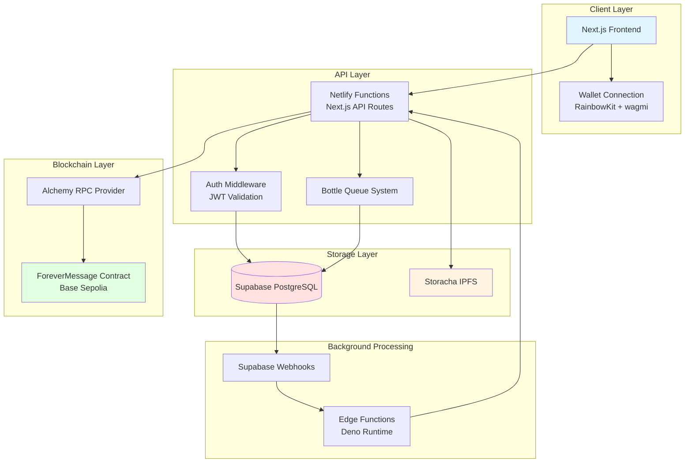
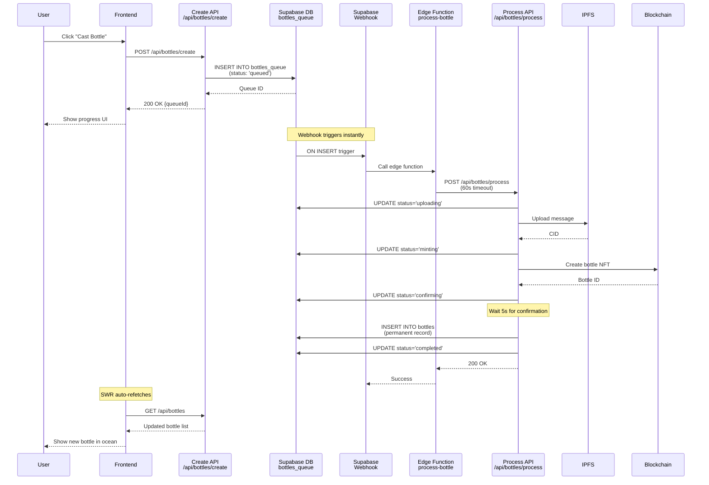

# Forever Message - Architecture Overview

## System Architecture

Forever Message is a decentralized application that allows users to create and share messages in digital bottles. The application combines blockchain technology, IPFS storage, and traditional web technologies to create an immersive experience.

### High-Level Architecture



## Monorepo Structure

Forever Message is organized as a monorepo with multiple packages, each of them as a separate repository:

```
forever-message/
├── forever-message-client/      # Next.js frontend application
├── forever-message-contract/    # Solidity smart contracts
├── forever-message-types/       # Shared TypeScript types
├── forever-message-ipfs/        # IPFS service library
└── forever-message-docs/        # Documentation (this repo)
```

### Package Responsibilities

**forever-message-client**
- Next.js 14 application with App Router
- React Three Fiber for 3D ocean visualization
- RainbowKit + wagmi for wallet connection
- Supabase client for authentication and data
- API routes for bottle operations

**forever-message-contract**
- Solidity smart contracts (ForeverMessage.sol)
- Deployment scripts using ethers.js
- Contract ABI exports
- Base Sepolia testnet deployment

**forever-message-types**
- Shared TypeScript interfaces (Bottle, Comment, Like)
- Type definitions for API responses
- Ensures type safety across packages

**forever-message-ipfs**
- Storacha (Web3.Storage) client wrapper
- IPFS upload/download utilities
- Principal key and proof management
- Error handling for IPFS operations

## Core Components

### 1. Frontend (Client)

**Technology Stack:**
- **Framework**: Next.js 14 (App Router, React Server Components)
- **3D Graphics**: React Three Fiber + Three.js
- **Canvas**: Konva (for 2D bottle rendering)
- **Animation**: anime.js (timeline-based UI orchestration), React Spring (physics)
- **Styling**: Tailwind CSS with custom glass-morphism and parchment design systems
- **State Management**: React hooks + SWR for data fetching
- **Wallet**: RainbowKit + wagmi + viem

**Key Features:**
- Interactive 3D ocean environment
- Drag-to-explore navigation
- Real-time bottle creation progress
- Wallet authentication with SIWE
- Progressive loading for performance

**User Experience Features:**
- Onboarding loading screen with animated explanations
- Real-time queue notifications with phase-based toasts
- Glass-morphism UI with ocean aesthetic
- Spring-based micro-interactions

### 2. Backend (API)

**API Routes:**

| Endpoint | Method | Purpose | Auth Required |
|----------|--------|---------|---------------|
| `/api/bottles` | GET | Fetch all bottles | No |
| `/api/bottles/create` | POST | Queue bottle creation | Yes |
| `/api/bottles/process` | POST | Process queued bottle | Internal |
| `/api/bottles/[id]` | GET | Get single bottle | No |
| `/api/bottles/[id]/like` | POST/GET | Toggle/check like | Yes |
| `/api/bottles/[id]/comments` | GET/POST | Get/add comments | Yes (POST) |
| `/api/auth/nonce` | GET | Get SIWE nonce | No |
| `/api/auth/verify` | POST | Verify SIWE signature | No |

### 3. Database (Supabase)

**Tables:**

**bottles**
```sql
- id (bigint, PK)
- creator (text) -- wallet address
- ipfs_hash (text)
- message (text)
- user_id (text) -- wallet address
- created_at (timestamp)
- expires_at (timestamp)
- is_forever (boolean)
- blockchain_status (text)
```

**bottles_queue**
```sql
- id (uuid, PK)
- message (text)
- user_id (text)
- status (text) -- queued, uploading, minting, confirming, completed, failed
- progress (int)
- ipfs_cid (text)
- blockchain_id (bigint)
- error (text)
- created_at, started_at, completed_at (timestamps)
```

**likes**
```sql
- id (uuid, PK)
- bottle_id (bigint, FK)
- user_id (text) -- wallet address
- created_at (timestamp)
```

**comments**
```sql
- id (bigint, PK)
- bottle_id (bigint, FK)
- ipfs_hash (text)
- user_id (text) -- wallet address
- blockchain_id (bigint)
- created_at (timestamp)
```

### 4. Smart Contract

**ForeverMessage.sol** (Base Sepolia: `0x0c925D3Ad30F7dee61A0D3E3bBdcd9069E97d4B1`)

**Key Functions:**
- `createBottle(string ipfsHash, address creator)` - Mint new bottle NFT
- `likeBottle(uint256 bottleId, address user)` - Emit like event
- `unlikeBottle(uint256 bottleId, address user)` - Emit unlike event
- `addComment(uint256 bottleId, string ipfsHash, address user)` - Emit comment event

**Events:**
- `BottleCreated(uint256 bottleId, address creator, string ipfsHash)`
- `BottleLiked(uint256 bottleId, address user)`
- `BottleUnliked(uint256 bottleId, address user)`
- `CommentAdded(uint256 bottleId, uint256 commentId, address user, string ipfsHash)`

### 5. IPFS Storage (Storacha)

**Stored Content:**
- Bottle messages (JSON format)
- Comment messages (JSON format)
- Metadata and timestamps

**Authentication:**
- Principal key stored in `STORACHA_PRINCIPAL_KEY` env var
- Delegation proof stored in `storacha-forever-message-proof.txt` file
- Space DID: `did:key:z6Mkt3yE57ADdGXA5bvf8hYGqzzQM4bqnvv6H3WGh83nK9ry`

### 6. Authentication System

**Sign-In With Ethereum (SIWE) Flow:**

1. User connects wallet (RainbowKit)
2. Client requests nonce from `/api/auth/nonce`
3. Client creates SIWE message with nonce
4. User signs message with wallet
5. Client sends message + signature to `/api/auth/verify`
6. Server verifies signature
7. Server creates Supabase auth session
8. Client stores JWT token
9. Subsequent API calls include `Authorization: Bearer <token>` header

**Session Management:**
- JWT tokens managed by Supabase Auth
- User metadata includes wallet address
- Middleware validates tokens on protected routes

## Deployment Architecture

### Production Environment

**Frontend & API:**
- Platform: Netlify
- Runtime: Node.js 20.x
- Timeout: 10s (default), 60s (processing route)
- Region: Global CDN

**Database:**
- Platform: Supabase (PostgreSQL)
- Webhooks: Trigger on `bottles_queue` insert
- Edge Functions: Deno runtime

**Blockchain:**
- Network: Base Sepolia (testnet)
- RPC: Alchemy
- Gas: Sponsored by deployer wallet

**Storage:**
- IPFS: Storacha
- Gateway: storacha.link
- Proof: Committed to repo (not secret)

### Environment Variables

**Required for Production:**
```env
# Blockchain
BASE_SEPOLIA_RPC_URL=https://base-sepolia.g.alchemy.com/v2/...
DEPLOYER_PRIVATE_KEY=0x...
NEXT_PUBLIC_CONTRACT_ADDRESS=0x0c925D3Ad30F7dee61A0D3E3bBdcd9069E97d4B1

# Supabase
NEXT_PUBLIC_SUPABASE_URL=https://...supabase.co
NEXT_PUBLIC_SUPABASE_ANON_KEY=eyJ...
SUPABASE_SERVICE_ROLE_KEY=eyJ... # Server-side only

# IPFS
STORACHA_PRINCIPAL_KEY=MgCaT...
# STORACHA_PROOF stored in file (committed)

# Misc
NEXT_PUBLIC_IPFS_GATEWAY=https://storacha.link/ipfs
NEXT_PUBLIC_WALLETCONNECT_PROJECT_ID=...
NETLIFY_FUNCTION_URL=https://your-site.netlify.app # For webhooks
```

## Async Processing Architecture

One of the most critical architectural decisions is how bottle creation is handled. Creating a bottle involves multiple slow operations (IPFS upload, blockchain transaction), which cannot be completed within Netlify's 10s function timeout.

### Solution: Queue + Webhook Pattern



### Why This Approach?

**Problem:** Netlify serverless functions kill background work when response is returned

**Alternatives Considered:**
1. **Synchronous processing** - User waits 5-10s ❌ (bad UX)
2. **Netlify Background Functions** - Requires Pro plan ($19/mo) ❌ (cost)
3. **Queue + Webhook** - Free, reliable, scalable ✅

**Benefits:**
- Instant response to user (queued in <1s)
- Reliable processing (60s timeout)
- Real-time progress tracking via `bottles_queue` status
- No additional cost
- Works with free tier

## Security Considerations

### Smart Contract Security
- No reentrancy vulnerabilities (no external calls before state changes)
- Access control for bottle creation (only authorized addresses)
- Immutable IPFS hashes (cannot be changed after creation)

### API Security
- JWT token validation on all protected routes
- SIWE signature verification prevents impersonation
- Service role key never exposed to client
- Rate limiting via Netlify (built-in)

### IPFS Security
- Delegation proof not a secret (committed to repo is safe)
- Principal key stored securely in env vars
- Content addressing prevents tampering

### Wallet Security
- Private keys never leave user's wallet
- Signatures required for all blockchain operations
- Clear transaction previews via RainbowKit

## Performance Optimizations

### Frontend
- **Progressive Loading**: Bottles load in batches of 20
- **Viewport Culling**: Only render visible bottles
- **Memoization**: Bottle positions cached
- **Lazy Loading**: OceanStage loaded client-side only
- **SWR Caching**: API responses cached with revalidation
- **Animation Performance**: anime.js for orchestrated sequences, RAF for sprite effects
- **Font Loading**: Custom fonts loaded from CDN with font-display strategy
- **Toast System**: Centralized notification store for reduced re-renders

### Backend
- **Connection Pooling**: Supabase handles DB connections
- **Indexed Queries**: `created_at` and `bottle_id` indexed
- **Batch Operations**: Comments fetched in single query
- **CDN Caching**: Static assets cached globally

### Blockchain
- **Event Indexing**: Supabase sync function reads events
- **Optimistic UI**: UI updates before blockchain confirmation
- **Gas Optimization**: Minimal storage in contract

## Monitoring & Observability

### Logging
- Client: `console.log` with `[Component]` prefixes
- API: `console.log` with `[API]` prefixes
- Errors: Full stack traces in development

### Metrics
- Netlify: Function duration, errors, bandwidth
- Supabase: Query performance, connection pool
- Alchemy: RPC call count, response times

### Debugging
- Browser DevTools for frontend
- Netlify function logs for API
- Supabase logs for database
- Etherscan for blockchain transactions

## Future Considerations

### Scalability
- Move to mainnet (Base or Optimism)
- CDN for IPFS gateway
- Redis cache for hot data
- Horizontal scaling via Supabase

### Features
- Gasless transactions (meta-transactions)
- NFT marketplace for rare bottles
- Bottle expiration mechanism
- Forever bottles (permanent storage)
- Social features (profiles, following)

### Maintenance
- Automated testing (unit, integration, e2e)
- CI/CD pipeline improvements
- Error monitoring (Sentry)
- Analytics (PostHog, Mixpanel)
