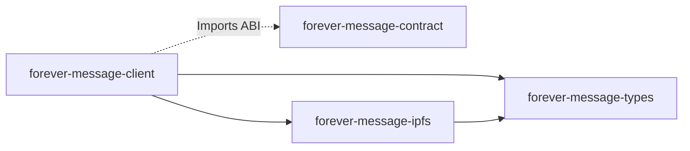

# Getting Started with Forever Message

This guide will help you understand the Forever Message codebase and get up to speed with development.

## Table of Contents
1. [Prerequisites](#prerequisites)
2. [Repository Structure](#repository-structure)
3. [Key Concepts](#key-concepts)
4. [Development Workflow](#development-workflow)
5. [Troubleshooting](#troubleshooting)

---

## Prerequisites

### Required Knowledge
- **JavaScript/TypeScript**: Core language
- **React & Next.js**: Frontend framework
- **Ethereum Basics**: Wallets, transactions, smart contracts
- **IPFS Concepts**: Content addressing, decentralized storage

### Tools & Accounts
- Node.js 20+ and Yarn
- Git and GitHub account
- MetaMask or another Web3 wallet
- (Optional) Alchemy account for RPC
- (Optional) Supabase account for database
- (Optional) Storacha account for IPFS
- (Optional) Reown Cloud account for AppKit

---

## Repository Structure

Forever Message is a **monorepo** containing multiple related packages:

```
forever-message/
├── forever-message-client/      # Main application
│   ├── app/                     # Next.js App Router
│   │   ├── api/                # API routes
│   │   ├── layout.tsx          # Root layout
│   │   ├── page.tsx            # Home page
│   │   └── providers.tsx       # React providers
│   ├── components/             # React components
│   │   ├── Ocean/              # Ocean visualization
│   │   └── Header.tsx          # Header with wallet
│   ├── hooks/                  # Custom React hooks
│   ├── lib/                    # Utilities
│   │   ├── auth/               # Authentication
│   │   ├── blockchain/         # Contract ABI
│   │   ├── data/               # Data fetching
│   │   └── supabase/           # Supabase clients
│   ├── public/                 # Static assets
│   └── supabase/               # Supabase config
│       └── functions/          # Edge functions
├── forever-message-contract/   # Smart contracts
│   ├── contracts/              # Solidity files
│   ├── scripts/                # Deployment scripts
│   └── test/                   # Contract tests
├── forever-message-types/      # Shared types
│   └── src/                    # TypeScript interfaces
├── forever-message-ipfs/       # IPFS service
│   └── src/                    # Storacha wrapper
└── forever-message-docs/       # Documentation
    └── architecture/           # Architecture docs
```

### Key Directories

**`app/` (Next.js App Router)**
- `page.tsx`: Home page (renders Ocean Stage)
- `layout.tsx`: Root layout (providers, sidebar)
- `api/`: API routes (bottles, auth, likes, comments)

**`components/`**
- `Introduction.tsx`: Onboarding screen with anime.js timeline
- `Header/`: App header with wallet connection
  - `index.tsx`: Header component (default export)
  - `LoginButton.tsx`: Wallet connection button
- `Sidebar/`: Notification system
  - `index.tsx`: Notification sidebar (default export)
  - `Toast.tsx`: Toast notification component
  - `BellIcon.tsx`: Notification bell icon
- `Bottle/`: Bottle-related components
  - `FloatingBottle.tsx`: Individual bottle rendering
  - `BottleModal.tsx`: Bottle detail view
  - `CreateBottleModal.tsx`: Bottle creation form with wax seal animation
  - `BottleSprite.tsx`: Bottle sprite rendering
  - `CreateBottleButton.tsx`: Floating button to create bottles
- `Ocean/`: Ocean visualization
  - `Stage.tsx`: Main 2D ocean canvas component
  - `Background.tsx`: Ocean background rendering
- `LOSCOLMEBROTHERSLogo.tsx`: Branded logo with hover animation
- `ErrorState.tsx`: Error display component

**`hooks/`**
- `useBottles.ts`: Fetch and manage bottles with progressive loading
- `useLikes.ts`: Like/unlike functionality
- `useBottleQueue.ts`: Real-time queue status tracking
- `useAuth.ts`: Exported from AuthContext
- `useComments.ts`: Comment fetching and management
- `useFrame.ts`: Animation frame utilities

**`lib/`**
- `auth/`: Authentication (AuthContext, middleware)
- `blockchain/`: Contract ABI and utilities
- `data/`: Data fetching helpers
- `supabase/`: Supabase client setup

**`supabase/functions/`**
- `process-bottle/`: Webhook-triggered bottle processor
- `sync-bottles/`: Cron job to sync blockchain events

---

## Key Concepts

### 1. Bottle Lifecycle

```
User creates bottle
  → Queued (bottles_queue)
    → Webhook triggers
      → Upload to IPFS (get CID)
        → Mint on blockchain (get bottle ID)
          → Confirm transaction
            → Insert into bottles table
              → Bottle appears in ocean
```

**Key Insight**: Bottles are queued immediately for fast UX, then processed asynchronously in the background.

### 2. Authentication Flow

```
User connects wallet (Reown AppKit)
  → Auto-trigger sign-in (SIWE)
    → Get nonce from server
      → Create SIWE message
        → User signs with wallet
          → Server verifies signature
            → Create Supabase session (JWT)
              → Store token in memory
                → Include token in API requests
```

**Key Insight**: No passwords needed. Wallet signature proves ownership of address.

### 3. Data Architecture

**Three Data Sources:**
1. **Database (Supabase)**: Fast queries, real-time updates
2. **Blockchain (Base Sepolia)**: Immutable source of truth
3. **IPFS (Storacha)**: Decentralized content storage

**Sync Strategy:**
- Write to DB first (fast UX)
- Write to blockchain second (immutable record)
- Periodic sync from blockchain to DB (recovery)

### 4. Monorepo Dependencies



**Publishing Flow:**
1. Make changes to `forever-message-types` or `forever-message-ipfs`
2. Run `yarn publish` to publish to npm
3. Update dependency in `forever-message-client`
4. Run `yarn install` in client

### 5. Animation Architecture

**Three Animation Approaches:**

1. **Timeline-Based (anime.js)**: For orchestrated multi-step sequences
   - Examples: Introduction, CreateBottleModal
   - When to use: Multi-step UI sequences, modal transitions, onboarding flows
   - Pattern: `createTimeline()` → `.add()` steps → promise-based completion
   - Timing: Precise control with delays, durations, and easing functions

2. **Physics-Based (React Spring)**: For natural, interactive motion
   - Examples: LOSCOLMEBROTHERSLogo hover, bottle physics
   - When to use: Hover effects, interactive elements, physics simulations
   - Pattern: `useSpring()` hooks with spring config
   - Feel: Natural bounce and momentum

3. **Frame-Based (RAF)**: For performance-critical sprite animations
   - Examples: SparkleEffect (16 sparkles simultaneously)
   - When to use: Sprite animations, particle effects, game-like interactions
   - Pattern: `requestAnimationFrame()` loop with cleanup
   - Control: Direct frame-by-frame manipulation

**Decision Guide:**
- Need a sequence with specific timing? → anime.js
- Need natural, bouncy motion? → React Spring
- Need 60fps sprite animation? → RAF

### 6. Design System Architecture

**Dual Aesthetic Approach:**

1. **Glass-Morphism (Ocean Theme)**
   - Purpose: UI controls, interactive elements, modern feel
   - Color: Cyan/turquoise/aquamarine palette (`#40E0D0`, `#20B2AA`, `#7FFFD4`)
   - Effects: Backdrop blur, subtle glows, semi-transparency
   - Files: Defined in `tailwind.config.js` and `app/globals.css`
   - Usage: Buttons, panels, notifications, interactive overlays
   - Example: `.glass-button` class for all action buttons

2. **Parchment (Vintage Theme)**
   - Purpose: Content-focused overlays, forms, messages
   - Color: Beige/brown/ink palette (`#f5f5dc`, `#e8e4d0`, `#2d1a0a`)
   - Effects: Paper texture, vintage shadows
   - Usage: Bottle creation modal, message displays
   - Example: `.parchment-surface` class for modal backgrounds

**Design Token Structure:**
```tsx
// Glass components use Tailwind classes
<button className="glass-button">Click me</button>

// Parchment components also use Tailwind classes
<div className="parchment-surface">Content here</div>

// Custom fonts applied globally
<p className="font-apfel">UI Text</p> // ApfelGrotezk
<span style={{fontFamily: 'AndreaScript'}}>Decorative</span>
```

**Typography:**
- **ApfelGrotezk**: Primary UI font (400, 500, 700, 800 weights)
- **AndreaScript**: Decorative script font for emphasis

---

## Development Workflow

### Initial Setup

1. **Clone the repository**
   ```bash
   git clone https://github.com/loscolmebrothers/forever-message.git
   cd forever-message/forever-message-client
   ```

2. **Install dependencies**
   ```bash
   yarn install
   ```

3. **Copy environment variables**
   ```bash
   cp .env.example .env.local
   ```

4. **Fill in required environment variables**
   - `BASE_SEPOLIA_RPC_URL`: Get from Alchemy
   - `DEPLOYER_PRIVATE_KEY`: Your wallet's private key (NEVER commit!)
   - `NEXT_PUBLIC_CONTRACT_ADDRESS`: Current contract address
   - `NEXT_PUBLIC_SUPABASE_URL`: From Supabase dashboard
   - `NEXT_PUBLIC_SUPABASE_ANON_KEY`: From Supabase dashboard
   - `SUPABASE_SERVICE_ROLE_KEY`: From Supabase dashboard (secret!)
   - `STORACHA_PRINCIPAL_KEY`: From `storacha key create --json`
   - `NEXT_PUBLIC_WALLETCONNECT_PROJECT_ID`: From WalletConnect Cloud

5. **Start development server**
   ```bash
   yarn dev
   ```

6. **Open browser**
   ```
   http://localhost:3000
   ```

### Running Tests

**Unit and Component Tests:**
```bash
yarn test              # Run all tests
yarn test:watch        # Watch mode for development
yarn test:coverage     # Generate coverage report
```

**End-to-End Tests:**
```bash
yarn cypress           # Open Cypress UI
yarn test:e2e          # Run E2E tests headless
```

**CI/CD Pipeline:**
```bash
yarn ci                # Runs: lint → format:check → build → test → test:e2e
```

**Code Formatting:**
```bash
yarn format            # Format all files
yarn format:check      # Check formatting without modifying
```

For detailed testing documentation, see `TESTING.md` in the client directory.

### Making Changes

#### Adding a New Feature

1. **Create a new branch**
   ```bash
   git checkout -b feature/my-feature
   ```

2. **Make changes**
   - Add components to `components/`
   - Add hooks to `hooks/`
   - Add API routes to `app/api/`

3. **Test locally**
   ```bash
   yarn dev
   yarn test        # Run unit tests
   yarn test:e2e    # Run E2E tests
   ```

4. **Check code quality**
   ```bash
   yarn ci          # Run full CI pipeline locally
   ```

5. **Commit and push**
   ```bash
   git add .
   git commit -m "Add my feature"
   git push origin feature/my-feature
   ```

6. **Create pull request** on GitHub

#### Modifying Smart Contracts

1. **Edit contracts**
   ```bash
   cd forever-message-contract
   vim contracts/ForeverMessage.sol
   ```

2. **Compile contracts**
   ```bash
   yarn compile
   ```

3. **Run tests**
   ```bash
   yarn test
   ```

4. **Deploy to testnet**
   ```bash
   yarn deploy:sepolia
   ```

5. **Update contract address** in client `.env.local`

6. **Update ABI** in `forever-message-client/lib/blockchain/contract-abi.ts`

#### Updating Shared Types

1. **Edit types**
   ```bash
   cd forever-message-types
   vim src/index.ts
   ```

2. **Build types**
   ```bash
   yarn build
   ```

3. **Publish to npm** (if changes are final)
   ```bash
   yarn publish
   ```

4. **Update client dependency**
   ```bash
   cd ../forever-message-client
   yarn add @loscolmebrothers/forever-message-types@latest
   ```

### Working with Worktrees

Worktrees allow you to work on multiple branches simultaneously.

**Create a worktree:**
```bash
cd forever-message-client
git worktree add ../my-feature -b my-feature
cd ../my-feature
# Now you have a separate directory for this branch
```

**List worktrees:**
```bash
git worktree list
```

**Remove worktree:**
```bash
git worktree remove ../my-feature
```

---

## Troubleshooting

### Common Issues

#### Issue: "Module not found: @loscolmebrothers/forever-message-types"

**Solution:**
```bash
cd forever-message-types
yarn build
yarn link

cd ../forever-message-client
yarn link @loscolmebrothers/forever-message-types
```

#### Issue: "Invalid nonce" when signing in

**Solution:**
- Clear browser cache
- Disconnect wallet and reconnect
- Check that nonce API route is working (`/api/auth/nonce`)

#### Issue: Bottles not appearing after creation

**Possible causes:**
1. Webhook not configured in Supabase
2. Edge function not deployed
3. IPFS upload failed
4. Blockchain transaction failed

**Debugging:**
1. Check `bottles_queue` table for status
2. Check Netlify function logs
3. Check Supabase edge function logs
4. Check Alchemy dashboard for transactions

#### Issue: "Failed to fetch IPFS content"

**Solution:**
- Check IPFS gateway is accessible
- Verify CID is valid
- Try different gateway: `ipfs.io` or `cloudflare-ipfs.com`

#### Issue: TypeScript errors in IDE

**Solution:**
```bash
# Restart TypeScript server in VS Code
# Cmd+Shift+P → "TypeScript: Restart TS Server"

# Or rebuild types
cd forever-message-types
yarn build
```

### Debugging Tips

**Enable verbose logging:**
```javascript
// In any component
console.log('[Component]', data)

// In API routes
console.log('[API]', request.body)
```

**Check database directly:**
- Open Supabase dashboard
- Go to "Table Editor"
- View `bottles_queue` for processing status

**Check blockchain transactions:**
- Go to Basescan Sepolia
- Search for your wallet address
- View recent transactions

**Check IPFS content:**
```
https://storacha.link/ipfs/<CID>
```

### Getting Help

**Documentation:**
- Architecture: `/architecture/overview.md`
- Data Flow: `/architecture/data-flow.md`
- Tech Stack: `/architecture/tech-stack.md`

**External Resources:**
- Next.js: https://nextjs.org/docs
- Reown AppKit: https://docs.reown.com/appkit
- Supabase: https://supabase.com/docs
- Storacha: https://docs.storacha.network

**Community:**
- GitHub Issues: Report bugs and request features
- Discord: (If available)

---

## Best Practices

### Code Style

**React Components:**
```typescript
// Good: Functional components with TypeScript
interface Props {
  bottleId: number;
}

export function MyComponent({ bottleId }: Props) {
  // Use hooks at the top
  const [state, setState] = useState<string>("");

  // Early returns for loading/error states
  if (!bottleId) return null;

  return <div>{/* JSX */}</div>;
}
```

**API Routes:**
```typescript
// Good: Use middleware for auth
export const POST = withAuth(async (request, user) => {
  try {
    // Validate input
    const body = await request.json();

    // Business logic
    const result = await doSomething(body);

    // Return success
    return NextResponse.json({ success: true, result });
  } catch (error) {
    // Handle errors
    console.error('[API]', error);
    return NextResponse.json({ error: 'Failed' }, { status: 500 });
  }
});
```

**Hooks:**
```typescript
// Good: Return an object, not an array
export function useMyHook(id: number) {
  const [data, setData] = useState(null);
  const [loading, setLoading] = useState(true);

  // Use SWR for API calls
  const { data: apiData } = useSWR(`/api/resource/${id}`, fetcher);

  return { data, loading, refetch: mutate };
}
```

### Performance

- Use `useMemo` for expensive calculations
- Use `useCallback` for event handlers passed to children
- Use `React.memo` for expensive components
- Lazy load heavy components with `dynamic` import

### Security

- Never commit `.env.local`
- Never expose service role keys to client
- Always validate input in API routes
- Use JWT middleware for protected routes
- Sanitize user input before displaying

---

## Next Steps

1. **Read Architecture Docs**: Understand the system design
2. **Explore Codebase**: Start with `app/page.tsx` and follow imports
3. **Make a Small Change**: Try changing text or colors
4. **Create a Bottle**: Test the full flow end-to-end
5. **Read API Routes**: Understand how data flows
6. **Pick a Task**: Look for GitHub issues labeled "good first issue"

Welcome to Forever Message! 🚀
